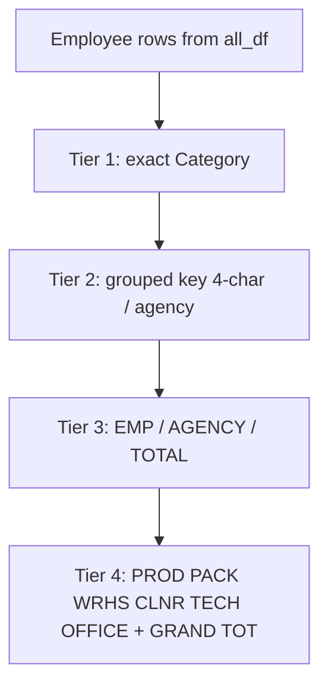

# Multi-tier category blocks on All Data sheet

## Goal

Match the attached spreadsheet layout on **All Data** in [`weekly/payroll_service.py`](weekly/payroll_service.py): four summary tiers below employee rows, bottom-to-top increasing aggregation:



Today only **tier 1** (granular + Grand total) and **tier 3** (EMP/AGENCY) exist in `build_excel_bytes` (~704–715). **Tier 2** and **tier 4** are missing.

## Rollup rules (no payroll logic change)

All tiers sum the same five bands already on each row: `BasicHours`, `MonFriOvertime`, `SatSunOvertime`, `AnnualHoliday`, `TotalPaidHours`.

| Tier | Source | Rule |
|------|--------|------|
| 1 Granular | `analysis_df` | Existing `_build_analysis_dataframe` — `groupby("Category")` |
| 2 Grouped | tier 1 rows | Reuse [`_grouped_key`](weekly/monthly_service.py) from monthly EXE (documented in [`Docs/monthly_from_decompile.md`](Docs/monthly_from_decompile.md)): first 4 chars; agency `A-*` → `A-XXX` + space + chars 6–9 |
| 3 EMP/AGENCY | `result.rows` | Existing `build_emp_agency_total_df` — unchanged |
| 4 Overall | tier 1 rows | Map each exact category to one bucket (verified on overtime test file — no `OTHER` rows): |

```python
def _overall_category_key(category: str) -> str:
    c = category.upper().strip()
    if "PKNG" in c: return "PACK"
    if "PROD" in c: return "PROD"
    if "WRHS" in c: return "WRHS"
    if "CLNR" in c: return "CLNR"
    if "TECH" in c: return "TECH"
    if c in ("OFCE", "DPCH") or "DPCH" in c: return "OFFICE"
    return "OTHER"  # tests fail if any appear
```

Fixed row order for tier 4: `PROD`, `PACK`, `WRHS`, `CLNR`, `TECH`, `OFFICE`, then **`GRAND TOT`** (sum of all six buckets; must equal tier 1 grand total and `TOTAL` in tier 3).

## Implementation in [`weekly/payroll_service.py`](weekly/payroll_service.py)

### 1. Shared helpers (new)

- **`_build_grouped_analysis_dataframe(analysis_df)`** — for each granular row, `k = _grouped_key(Category)` (import from [`monthly_service`](weekly/monthly_service.py) to stay aligned with monthly week sheets), sum bands, sort by key.
- **`_build_overall_analysis_dataframe(analysis_df)`** — bucket via `_overall_category_key`, emit rows in fixed order, omit empty buckets (or include with 0 — prefer include all six for stable layout like screenshot).
- **Refactor `_append_category_breakdown_block`** → generic **`_append_hour_totals_block(ws, df, start_row, label_col_name="Category", grand_label="Grand total")`** so grouped and overall blocks reuse the same column layout (label in col B, numbers in D–H, blank col A).

### 2. Wire `build_excel_bytes` (layout only)

After `all_df.to_excel` and when `analysis_df` is non-empty:

```text
gap
[tier 1 granular + Grand total]     → border
gap
[tier 2 grouped, no grand total]    → border  (optional: omit grand — tier 4 has GRAND TOT)
gap
[tier 3 EMP / AGENCY / TOTAL]       → border (matches boxed table in screenshot)
gap
[tier 4 overall + GRAND TOT]        → border
```

Keep separate sheets (`Analysis`, `Category summary`, `EMP Agency Total`) unchanged.

### 3. Tests in [`weekly/test_payroll_contract.py`](weekly/test_payroll_contract.py)

- Extend `test_category_breakdown_block_column_offset` (or add `test_all_data_multi_tier_blocks`):
  - After first `"Category"` block, find second `"Category"` header → grouped block exists.
  - Find `"Summary"` → EMP block still at correct offset.
  - Find `"GRAND TOT"` (or `"Grand total"` only on tier 1; tier 4 uses `"GRAND TOT"` per screenshot) in last block.
- Integration test on `data/ovettime_error_test_data/dgross_paysummary2 (3).xls` + contract: grouped row count ≈ 18 keys; overall buckets sum to same `TotalPaidHours` as granular grand total.

## Files touched

| File | Change |
|------|--------|
| [`weekly/payroll_service.py`](weekly/payroll_service.py) | New rollup builders, refactor append helper, extend `build_excel_bytes` |
| [`weekly/test_payroll_contract.py`](weekly/test_payroll_contract.py) | Assert multi-block layout and totals consistency |

No changes to `calculate_payroll`, views, or monthly export unless you later want the same tiers on monthly `WeekN` sheets (out of scope).

## Risk / assumption

High-level mapping (`PACK` = any `PKNG`, `OFFICE` = `OFCE`/`DPCH`) is inferred from your screenshot and validated on current test categories (26 granular → 6 buckets, no orphans). If you use categories outside these tokens, we will surface them as `OTHER` in tier 4 and fail tests until mapping is extended.
