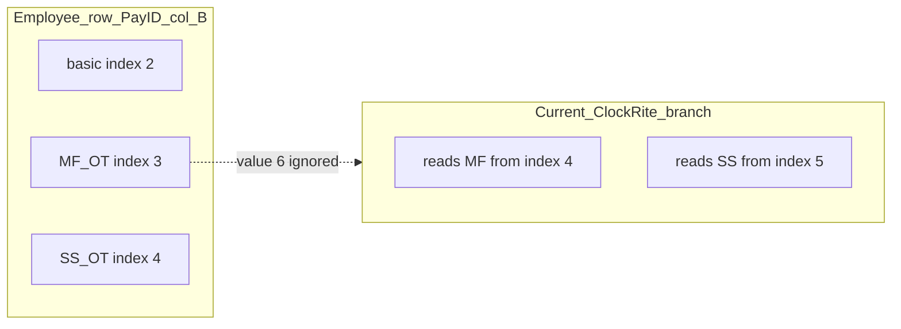

# Audit and fix ClockRite Mon–Fri / Sat–Sun overtime columns

## What is happening today

Evidence from [`data/dgross_paysummary2.xls`](data/dgross_paysummary2.xls) row for **SageNo 747** (`B DIKER`):

| 0-based index | Excel (approx.) | Cell value |
|---------------|-----------------|------------|
| 2 | C | `41.25` (treated as gross basic) |
| **3** | **D** | **`6`** (Mon–Fri OT you expect) |
| 4 | E | empty |

[`parse_employee_hours`](weekly/payroll_service.py) enables the **ClockRite grid** branch when the header row has **Pay ID** in column B and **`Sage`** in column D (row 5 in the sheet). In that branch it sets:

```python
mon_fri_col = pay_id_col + 3   # column E
sat_sun_col = pay_id_col + 4   # column F
```

So the parser reads **`6` from column D into nothing**—it assigns **MF OT from E** (empty) **and SS OT from F** (empty). Result:

- `MonFriOvertime` = 0  
- `SatSunOvertime` = 0  
- `TotalPaidHours` = 41.25 (should include +6 MF OT ⇒ **47.25** once basic/annual netting is unchanged)

Confirmed by running [`parse_employee_hours`](weekly/payroll_service.py) on this file:

`{'MonFriOvertime': 0.0, 'SatSunOvertime': 0.0, 'TotalPaidHours': 41.25}` for Sage 747.

**Root cause:** The header labels (`Sage`, `Hrs @ 1`, `Hrs @ 2`) in row 5 do **not** line up one-for-one with the **employee-row positions** used for totals in this export. The payroll-relevant OT amounts for display sit in **D/E** relative to Pay ID column B—not **E/F**. The regression was introduced when the ClockRite branch shifted OT right by one column compared to the non-ClockRite offset path (`+2` / `+3` after Pay ID).



## Why this is a money risk

`TotalPaidHours` is used for reporting, **Overtime** (`TotalPaidHours − ContractedHours`), and exports. Under-counting paid OT **understates totals and overtime** for affected staff.

## Fix (minimal, align with data)

In [`weekly/payroll_service.py`](weekly/payroll_service.py), inside the `clockrite_grid` block of `parse_employee_hours`:

1. Set **`mon_fri_col = pay_id_col + 2`** (column D).
2. Set **`sat_sun_col = pay_id_col + 3`** (column E).
3. **Keep unchanged:** `basic_col = pay_id_col + 1`, annual logic via **`_annual_holiday_clockrite_hl`** (indices 7 / 11), and `basic_hours = basic_gross - annual`, `total_paid = basic_hours + mon_fri_ot + sat_sun_ot + annual`.

4. **Comment** near that block documenting that Paid Hours Summary employee rows place MF/SS OT immediately after gross basic—even when row-5 wording says Sage / Hrs @ 1 / @ 2.

## Tests

- Extend or add a unit test (e.g. in [`weekly/test_payroll_contract.py`](weekly/test_payroll_contract.py)) that builds a small workbook with ClockRite header pattern (Pay ID B, Sage header D), one employee row with **basic in C**, **MF OT in D**, optional **SS in E**, and optional annual in H/L; assert correct `MonFriOvertime`, `SatSunOvertime`, **`TotalPaidHours`**.
- Optional: deterministic check that parses [`data/dgross_paysummary2.xls`](data/dgross_paysummary2.xls) and asserts record for **`SageNo == 747`** has `MonFriOvertime == 6.0` and `TotalPaidHours == 47.25` — only if committing this `.xls` to CI is acceptable; otherwise keep the synthetic fixture.

## Sanity check after patch

Re-run parsing on **`dgross_paysummary2.xls`**: 747 shows **MF 6**, **Total** includes it; spot-check another row whose col D/E match expectations (e.g. `R BABU` col D `0.25`) so we do not regress other employees.
