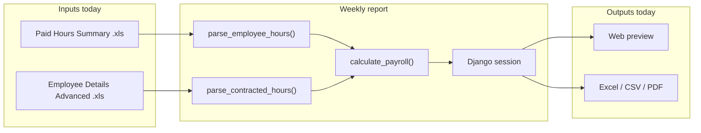
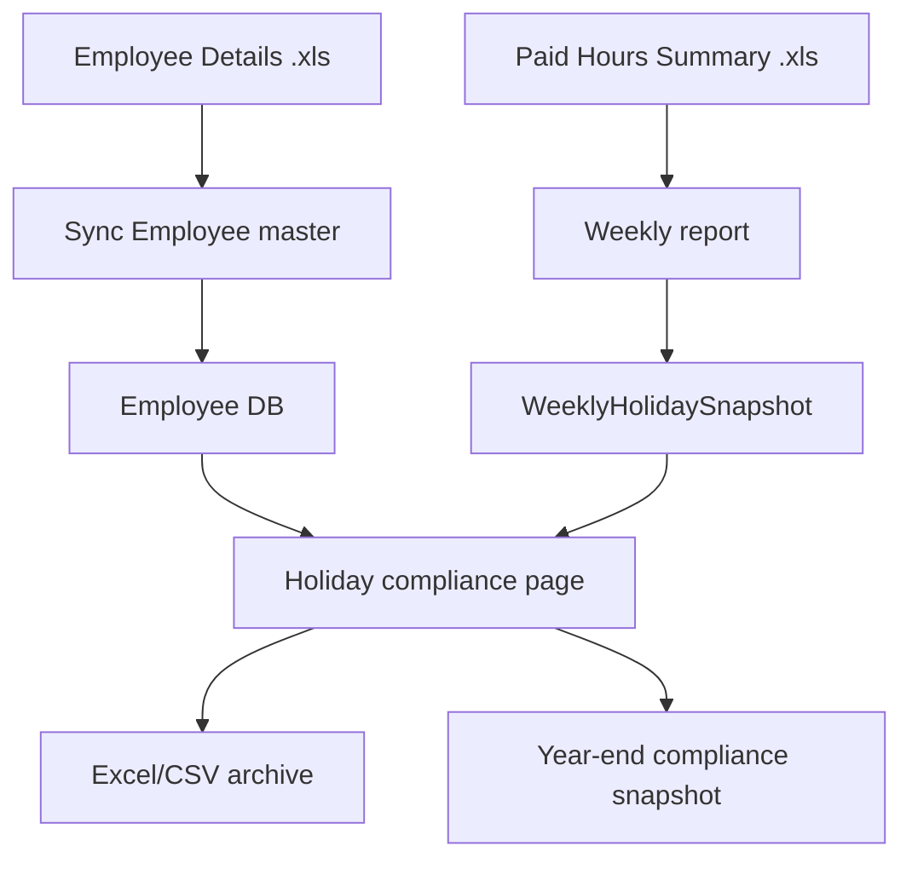

# UK Holiday Compliance — Current State & Plan

## What Gazebo HR does today (not compliance yet)

The app is a **stateless weekly payroll reporter**. No holiday data is saved to the database ([`weekly/models.py`](weekly/models.py) is empty).



**Holiday-related behaviour today:**

| What | How |
|------|-----|
| `AnnualHoliday` | Hours **paid as annual leave in that one pay week** — read from ClockRite columns H/L in the Paid Hours file ([`payroll_service.py`](weekly/payroll_service.py) lines 110–118, 195–210) |
| `ContractedHours` | Weekly **contract hours** from Employee Details file — used for overtime only, not entitlement |
| Storage | Session only — **lost when session ends** |
| Employee directory | [`employee_hour_contracts`](weekly/templates/weekly/employee_hour_contracts.html) is a **placeholder** |

**This is payroll reporting, not UK compliance.** Compliance needs per-employee **entitlement (days)**, **leave taken (cumulative)**, **remaining balance**, **leave year**, and **6-year retention** — none of which exist yet.

---

## Inputs required

### Already have (keep using)

1. **Paid Hours (Inc Absence) Summary** (`dgross_paysummary2.xls`) — weekly
   - Gives per employee: `AnnualHoliday` hours, basic, overtime, Pay ID
2. **Employee Details (Advanced)** (`demployees_2023.xls`) — refresh when contracts change
   - Gives per employee: **Contract Hrs** (weekly hours), Payroll Number, name

### Need to add

| Input | Source | Why |
|-------|--------|-----|
| **Days per week** | **Derive from Contract Hrs** (recommended) | Entitlement = `days × 5.6` |
| **Hours per day** | Setting (default **8**) or `contract_hrs ÷ days` | Convert `AnnualHoliday` hours → days taken |
| **Leave year** | Setting (e.g. 1 Jan – 31 Dec or tax year) | Scope entitlement & taken |
| **Manual overrides** | Admin UI on employee record | Fix edge cases (e.g. 37.5 hr week, 4.5 days) |

### Best practice for days/week (your uncertainty answered)

ClockRite does **not** export “days per week” directly — only **Contract Hrs** (weekly hours).

**Recommended default:**

```
days_per_week = contract_hrs ÷ HOURS_PER_DAY   # HOURS_PER_DAY = 8 in settings
```

Examples with 8-hour day assumption:

| Contract Hrs | Derived days/week | Entitlement (× 5.6) |
|--------------|-------------------|---------------------|
| 40 | 5 | 28 days |
| 24 | 3 | 16.8 days |
| 30 | 3.75 → round up 0.5 → **4** | 22.4 days |

- Auto-derive on each contract import; store on `Employee` record
- Show derived value on employee page; allow **manual override** when wrong
- No separate spreadsheet needed unless you prefer bulk correction

### Leave taken — use existing ClockRite data

For regular workers, **do not** need raw clock-in/out export. Sum `AnnualHoliday` hours from each weekly upload across the leave year, then convert to days:

```
leave_taken_days = cumulative_annual_holiday_hours ÷ hours_per_day
remaining = entitlement_days − leave_taken_days
```

This matches your current workflow: import ClockRite report → calculate.

---

## What to build (3 phases, keep simple)

### Phase 1 — Employee master (from contract file)

**Goal:** Persistent employee list with days/week and entitlement.

- Add models in [`weekly/models.py`](weekly/models.py):
  - `Employee` — `sage_no`, `name`, `contract_hrs`, `days_per_week`, `days_per_week_override`, `hours_per_day`, `active`
  - `derive_days_per_week()` helper using settings `HOURS_PER_DAY = 8`
- New service [`weekly/employee_service.py`](weekly/employee_service.py) — reuse `parse_contracted_hours()` + `parse_employee_display_names()` from [`payroll_service.py`](weekly/payroll_service.py)
- Management command or upload on **Employee hour contracts** page to sync from Employee Details file
- Entitlement calc: `round_up_half(days_per_week × 5.6)`

### Phase 2 — Accumulate leave from weekly uploads

**Goal:** Each weekly run saves holiday hours per employee per week.

- Add model `WeeklyHolidaySnapshot` — `employee`, `week_ending`, `annual_holiday_hours`, `source_file_date`
- Hook into [`weekly_report` view](weekly/views.py) POST handler: after `calculate_payroll()`, upsert snapshots by `SageNo`
- Add `holiday_service.py`:
  - `entitlement_days(employee, leave_year)`
  - `leave_taken_days(employee, leave_year)` — sum snapshots in year
  - `remaining_days(employee, leave_year)`

### Phase 3 — Compliance report & retention

**Goal:** Auditable per-employee record exportable for 6 years.

- New page: **Holiday compliance** (`/dashboard/holiday-compliance/`)
  - Table: Name, days/week, entitlement, leave taken, remaining, pay rate (manual field later)
  - Filter by leave year
  - Export Excel/CSV labelled by tax year
- Add model `HolidayComplianceSnapshot` — frozen year-end record (JSON or denormalised fields) for 6-year archive; never delete on employee departure (`active=False` only)
- Optional Phase 3b: carry-over, termination pay, encouragement evidence — manual fields on employee/year record



---

## What we deliberately skip (for now)

- Irregular/zero-hours 12.07% formula — all employees are regular-hours per your decision
- Raw ClockRite attendance export — Paid Hours file already has `AnnualHoliday`
- HR paper leave forms — replaced by cumulative ClockRite paid holiday hours unless you later want a manual adjustment field
- Holiday pay rate incl. OT/commission — add as optional `pay_rate` field in Phase 3b

---

## Suggested implementation order

1. **Employee model + contract import** on existing placeholder page
2. **Entitlement display** (days/week × 5.6) before any weekly accumulation
3. **Weekly snapshot on process** — minimal change to existing weekly flow
4. **Compliance report + export**
5. **Year-end snapshot** for 6-year retention

---

## Key files to touch

| File | Change |
|------|--------|
| [`weekly/models.py`](weekly/models.py) | Employee, WeeklyHolidaySnapshot, HolidayComplianceSnapshot |
| [`weekly/employee_service.py`](weekly/employee_service.py) | New — sync + days derivation |
| [`weekly/holiday_service.py`](weekly/holiday_service.py) | New — entitlement / taken / remaining |
| [`weekly/views.py`](weekly/views.py) | Employee sync page; snapshot on weekly POST; compliance view |
| [`weekly/urls.py`](weekly/urls.py) | New routes |
| [`config/settings.py`](config/settings.py) | `HOURS_PER_DAY`, `LEAVE_YEAR_START` |
| [`weekly/payroll_service.py`](weekly/payroll_service.py) | No formula changes — reuse parsers as-is |

Existing tests in [`weekly/test_payroll_contract.py`](weekly/test_payroll_contract.py) stay; add tests for days derivation and entitlement rounding.
